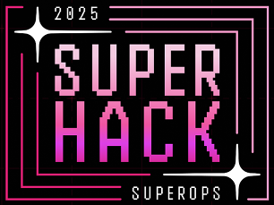
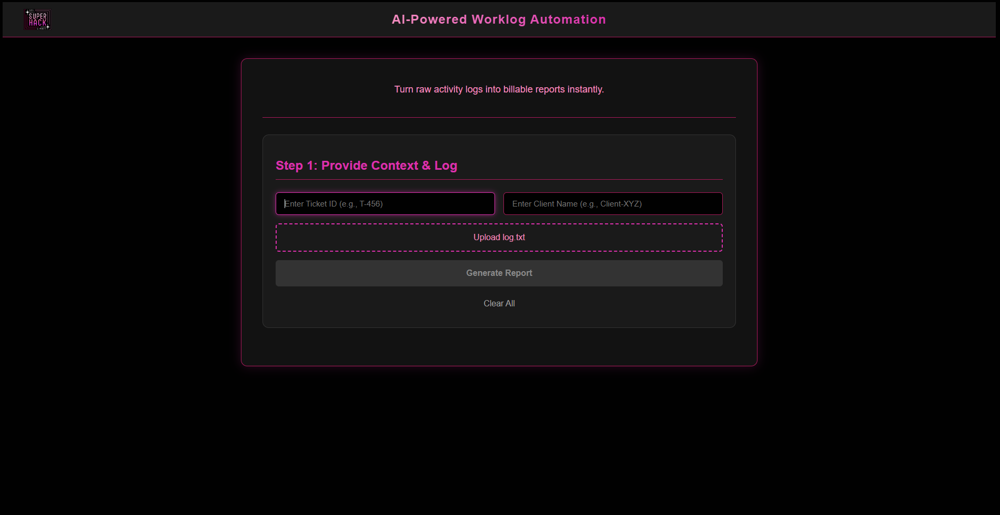
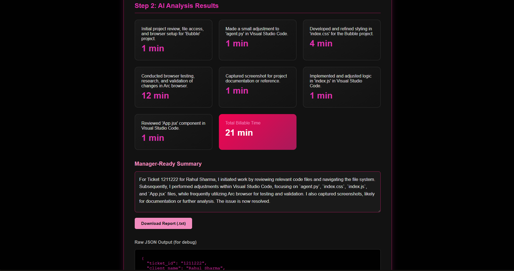

# Smart Time Tracker – AI-Powered Worklog Automation
[](https://lakraanshul.github.io/SUPERHACK/)


A hackathon submission for **SuperHack 2025**. This project automatically captures a technician's work activity and uses Generative AI to instantly convert messy logs into clean, billable timesheets and manager-ready reports.


---

## 📸 Screenshots

Here's a look at the live application.

| Main Dashboard | AI Analysis Results |
| :---: | :---: |
|  |  |

---

## Problem Statement

IT technicians and MSPs waste 15-20% of their day manually logging work. This process is tedious, inaccurate, and leads to significant lost revenue from unbilled tasks. Our solution automates this entire workflow.

## ✨ Core Features

* **🖥️ Local Activity Agent:** A lightweight Python script runs in the background to capture active window titles.
* **🧠 AI-Powered Analysis:** A Node.js backend uses the Google Gemini AI to read the messy logs and identify billable vs. non-billable tasks.
* **📊 Dynamic Dashboard:** A React frontend provides a clean UI to input ticket context (ID, Client) and upload the log.
* **📄 Instant Report Generation:** In seconds, the AI generates a breakdown of all activities, a total billable time, *and* a professional, manager-ready summary.
* **⬇️ Downloadable Reports:** The generated summary can be instantly downloaded as a `.txt` file.

---

## 🛠️ Tech Stack

* **Frontend:** React (Vite), Axios
* **Backend:** Node.js, Express, Google AI (Gemini)
* **Agent:** Python, `pygetwindow`

---

## 📁 Project Structure

```
/Bubble
├── /bubble-agent
│   ├── agent.py          # The Python script to run on the technician's PC
│   └── log.txt           # Generated by the agent
│
├── /bubble-backend
│   ├── node_modules/
│   ├── .gitignore        # Ignores node_modules and .env
│   ├── index.js          # The Express server with /analyze and /generate-report
│   ├── package.json
│   └── .env              # YOUR SECRET API KEY LIVES HERE
│
├── /bubble-frontend
│   ├── public/
│   │   └── /images/
│   │       └── superhack-logo.png
│   ├── src/
│   │   ├── App.jsx       # Main React component
│   │   ├── index.css     # All styling
│   │   └── ...
│   └── ...
│
└── README.md             # This file
```

---

## 🚀 Getting Started

Follow these steps to run the project locally.

### Prerequisites

* Node.js (v18+)
* Python (v3.8+)
* An API Key from [Google AI Studio](https://aistudio.google.com/)

### 1. Backend Setup (AI Brain)

```bash
# 1. Navigate to the backend folder
cd bubble-backend

# 2. Install dependencies
npm install

# 3. Create your environment file
# (On Windows, you can just create a new file named .env)
touch .env

# 4. Open .env and add your API key
API_KEY=YOUR_GOOGLE_AI_API_KEY_HERE

# 5. Start the server!
node index.js
# Server will be running at http://localhost:3000
```

### 2. Agent Setup

```bash
# 1. Open a NEW terminal and navigate to the agent folder
cd bubble-agent

# 2. Install dependencies
pip install pygetwindow pynput

# 3. You don't need to run this yet. Proceed to frontend setup.
```

### 3. Frontend Setup (Dashboard)

```bash
# 1. Open a THIRD terminal and navigate to the frontend folder
cd bubble-frontend

# 2. Install dependencies
npm install

# 3. Start the React development server
npm run dev
# App will open at http://localhost:5173 (or a similar port)
```

---

## 💡 How to Use (Demo Workflow)

1.  Ensure your **Backend** (`node index.js`) and **Frontend** (`npm run dev`) servers are running.
2.  Run the **Agent** script in its terminal to start capturing activity:
    ```bash
    python agent.py
    ```
3.  Simulate a few minutes of work. Click on different windows (VS Code, your browser, Outlook, etc.).
4.  Stop the agent by pressing `Ctrl + C` in its terminal. This finalizes the `log.txt` file.
5.  Go to the React app in your browser (`http://localhost:5173`).
6.  Fill in the **Ticket ID** (e.g., "T-456") and **Client Name** (e.g., "Acme Corp").
7.  Click **"Upload log.txt"** and select the file from the `bubble-agent` folder.
8.  Click the **"Generate Report"** button.
9.  Watch as the AI populates the activity cards, total time, and the manager-ready summary.
10. Click **"Download Report"** to save your summary!